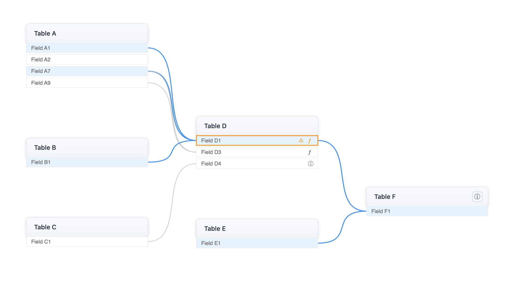

# react-lineage-map 

A powerful React component for visualizing and managing data lineage with field-level mapping, transformations, and interactive features.


 <br/>
[](https://codesandbox.io/p/sandbox/mlcpzy)




## Table of Contents
- [Features](#features)
- [Installation](#installation)
- [Usage](#usage)
- [Configuration Options](#configuration-options)
- [Type Definitions](#type-definitions)
- [Contributing](#contributing)
- [License](#license)


## Features

### Core Visualization
- Interactive SVG-based visualization of data lineage relationships
- Automatic layout calculation with configurable levels and spacing
- Smooth curved edges showing relationships between fields
- Zoom and pan functionality for large lineage maps

### Table Features
- Expandable/collapsible tables showing field details
- Table-level notes and documentation support
- Visual indication of table relationships
- Automatic table positioning based on dependencies

### Field Features
- Capture field-level transformation and notes
- Interactive field highlighting based on relationships
- Support for SQL blocks in field documentation
- Field validation with error highlighting


## Installation

```bash
npm install react-lineage-map
```

## Usage

### Basic Example

```typescript
import { GraphProp, LineageMapComponent } from "react-lineage-map";

const graph: GraphProp = {
  nodes: [
    // Tables
    { 
      id: 'source_table', 
      type: 'table', 
      name: 'Source Table',
      note: 'Optional source table documentation' 
    },
    {
      id: 'target_table', 
      type: 'table', 
      name: 'Target Table',
      note: 'Optional target table documentation' 
    },
    // Fields
    { 
      id: 'source_table:field1', 
      type: 'field', 
      name: 'Field 1',
      transformation: 'Optional transformation logic',
      note: 'Optional field documentation' 
    },
    { 
      id: 'target_table:field1', 
      type: 'field', 
      name: 'Field 1',
      transformation: 'Optional transformation logic',
      note: 'Optional field documentation' 
    }
  ],
  edges: [
    { 
      source: 'source_table:field1', 
      target: 'target_table:field1' 
    }
  ]
};

function App() {
  return (
    <div style={{ height: '800px' }}>
      <LineageMapComponent
        data={graph}
        height="100%"
        options={{
          tableWidth: 250,
          tableHeight: 40,
          fieldHeight: 20,
          fieldSpacing: 4,
          levelPadding: 100,
          verticalPadding: 50,
          popUpWidth: 300,
          maxCurveOffset: 80,
        }}
      />
    </div>
  );
}
```

## Configuration Options

### Component Options

| Option | Type | Default | Description |
|--------|------|---------|-------------|
| width | string | '100%' | Width of the lineage map |
| height | string | '100%' | Height of the lineage map |
| tableWidth | number | 150 | Width of table nodes |
| tableHeight | number | 40 | Height of table header |
| fieldHeight | number | 20 | Height of field rows |
| fieldSpacing | number | 4 | Vertical spacing between fields |
| levelPadding | number | 100 | Horizontal spacing between levels |
| verticalPadding | number | 50 | Vertical spacing between tables |
| popUpWidth | number | 300 | Width of documentation popups |
| maxCurveOffset | number | 100 | Maximum curve of edge connections |

## Type Definitions

### User-Facing Types

These are the types you need to work with when using the component:

#### Graph Props
```typescript
interface GraphProp {
  nodes: NodeProp[];    // Array of table and field nodes
  edges: EdgeProp[];    // Array of edges connecting nodes
}
```

#### Node Props
```typescript
// Base node properties
interface BaseNode {
  id: string;           // Unique identifier
  name: string;         // Display name
}

// Table node definition
interface TableNode extends BaseNode {
  type: 'table';        // Node type identifier
  note?: string;        // Optional documentation
}

// Field node definition
interface FieldNodeProp extends BaseNode {
  type: 'field';        // Node type identifier
  tableId?: string;     // Optional reference to parent table
  transformation?: string; // Optional transformation logic
  note?: string;        // Optional documentation
}

type NodeProp = TableNode | FieldNodeProp;
```

#### Edge Props
```typescript
interface EdgeProp {
  id?: string;          // Optional unique identifier
  source: string;       // Source node ID
  target: string;       // Target node ID
}
```

#### Component Props
```typescript
interface LineageMapProps {
  data: GraphProp;      // Graph data
  width?: string | number; // Optional width override
  height?: string | number; // Optional height override
  options?: LineageMapOptions; // Optional configuration
  className?: string;   // Optional CSS class
}

interface LineageMapOptions {
  width?: string | number;     // Width of the lineage map
  height?: string | number;    // Height of the lineage map
  tableWidth?: number;         // Width of table nodes
  tableHeight?: number;        // Height of table header
  fieldHeight?: number;        // Height of field rows
  fieldSpacing?: number;       // Vertical spacing between fields
  levelPadding?: number;       // Horizontal spacing between levels
  verticalPadding?: number;    // Vertical spacing between tables
  popUpWidth?: number;         // Width of documentation popups
  maxCurveOffset?: number;     // Maximum curve of edge connections
}
```

### Key Differences from Internal Types

When using the component, note these key differences from internal types:

1. `FieldNodeProp` has an optional `tableId`, while the internal `FieldNode` requires it
2. `EdgeProp` has an optional `id`, while the internal `Edge` requires it
3. Edge types (`field-field` | `table-table`) are handled internally and don't need to be specified
4. The component will automatically handle type conversions and validations internally

### Example Usage

```typescript
const graph: GraphProp = {
  nodes: [
    // Table node
    {
      id: 'table1',
      type: 'table',
      name: 'Source Table',
      note: 'This is a source table'
    },
    // Field node - minimal
    {
      id: 'table1:field1',
      type: 'field',
      name: 'Field 1'
    },
    // Field node - full
    {
      id: 'table1:field2',
      type: 'field',
      name: 'Field 2',
      tableId: 'table1',
      transformation: 'table1:field1 * 2',
      note: 'This field doubles the value of field1'
    }
  ],
  edges: [
    // Minimal edge
    {
      source: 'table1:field1',
      target: 'table1:field2'
    },
    // Edge with ID
    {
      id: 'edge1',
      source: 'table1:field1',
      target: 'table1:field2'
    }
  ]
};

// Component usage
<LineageMapComponent
  data={graph}
  width="100%"
  height="800px"
  options={{
    tableWidth: 250,
    levelPadding: 100
  }}
  className="my-lineage-map"
/>
```

## Special Features

### Field and Table Documentation  

#### SQL Notes  
- Support for both plain text and SQL blocks in notes
- SQL blocks are formatted and syntax highlighted
- Use `---startsql` and `---endsql` tags to denote SQL blocks
```typescript
// SQL blocks in table notes
{
  id: 'customer_table',
  type: 'table',
  note: `This table contains filtered customer data:
          ---startsql
          SELECT * FROM customers
          WHERE status = 'active'
          ---endsql
          Only active customers are included`
}

// SQL blocks in field notes
{
  id: 'table:field1',
  type: 'field',
  note: `This field is calculated using the following SQL:
          ---startsql
          SELECT 
            SUM(value) / COUNT(*) as average
          FROM source_table
          ---endsql
          The result is then normalized.`
}
```

#### Using `\n` for Newlines in Notes  

When concatenating strings in field notes, use `\n` to create newlines. This is especially useful for formatting bulleted lists or separating information clearly.  

```typescript
{
  id: 'table:field2',
  type: 'field',
  note: 'Key details:\n' +
        '- This field is calculated monthly.\n' +
        '- Includes only active users.\n' +
        '- Excludes test data.'
}
```

### Transformation Validation
The component automatically validates:
- Field references in transformations
- Existence of referenced fields
- Edge connections matching transformations
- Missing or extra edge connections

### Interactive Features
- Click tables to expand/collapse
- Hover over fields to highlight relationships
- Click fields to view transformations
- Click info icons to view documentation
- Zoom and pan for navigation

## Best Practices

1. **Node IDs**: 
   - Table IDs should be unique and consistent
   - Field IDs should follow the format `table_id:field_name`
   - Use underscores instead of spaces in IDs

2. **Documentation**:
   - Use table notes for high-level context
   - Use field notes for detailed specifications
   - Include SQL blocks for complex transformations

3. **Layout**:
   - Group related tables in levels
   - Keep transformations clear and documented
   - Use consistent naming conventions

## Contributing

Contributions are welcome! Please feel free to submit a Pull Request.

## License

MIT